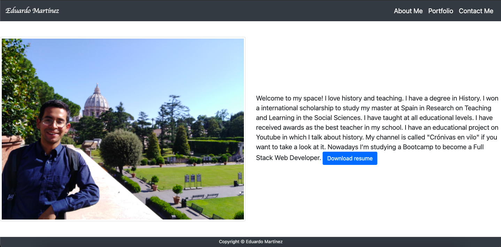
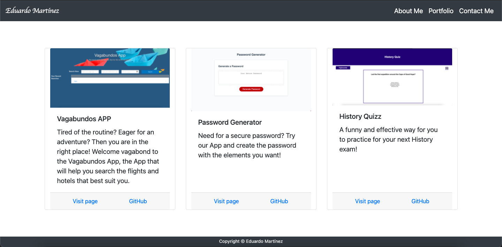
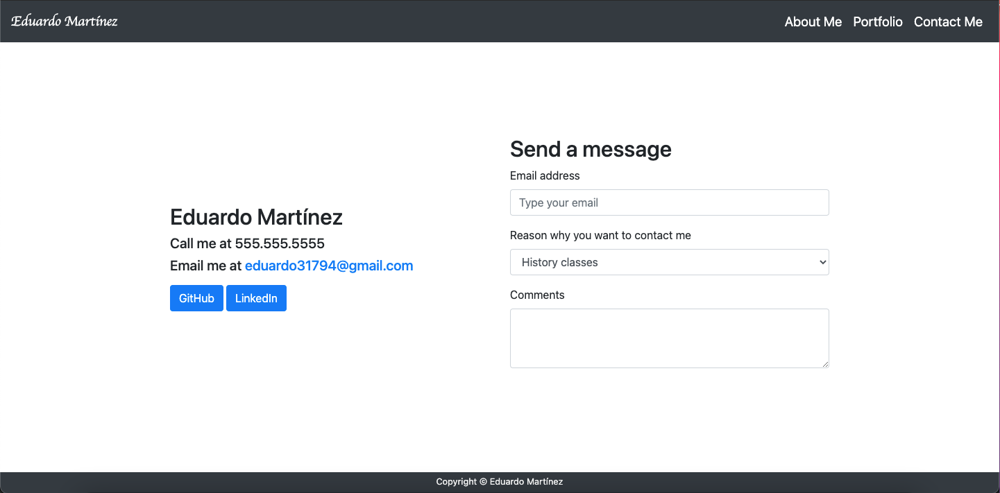

# Professional Portfolio

## Description
I made this page to have a professional website where all my projects are display.

## Installation

This project has been deployed to GitHub.
https://eduadomtz.github.io/Professional-Porfolio/

To get this project up and running, you can follow the deployment link.
 https://github.com/Eduadomtz/Professional-Porfolio

 
## Usage
It has 3 parts: About me, portfolio and contact me

When the user enters my site, the firts thing is going to find is the "About me" section

Then, the user can see all of my projects displayed in the "Portfolio" section

Finally if the user wants to contact me he can find my number, email and GitHub and Linkedin profiles. They also have the possibility to send me a message from the site

## Features
HTML Pages Index.html

Bootstrap

Google Fonts

